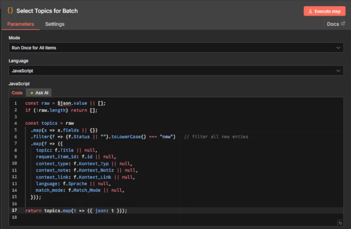
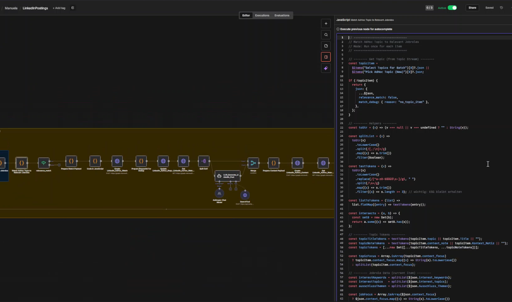
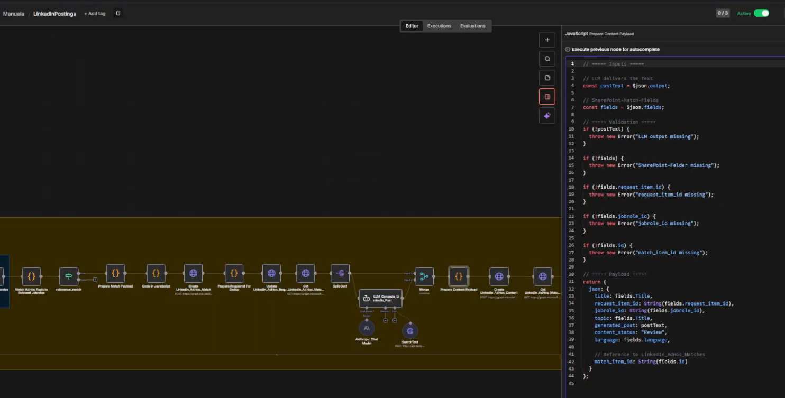

# LinkedIn Content Workflow Automation

End-to-end workflow system for generating role-specific LinkedIn carousel drafts from structured topic requests.

This project was conceived and implemented by me during my work with Procycons. Starting from a narrow brief — automate LinkedIn posts for EcoFlow based on predefined job roles and carousel format — I designed and built the full workflow logic, data structure, prompting setup, and review process.

---

## Context

The initial brief was simple:

- automate LinkedIn posts for EcoFlow
- use the provided target job roles
- generate carousel-style posts

From that starting point, I designed a complete internal content workflow system that supports:

- structured topic intake
- role-based matching
- LLM-assisted draft generation
- human review and approval
- publishing status management

---

## My Role

I independently designed and implemented the full solution, including:

- SharePoint list structure
- request, match, and content data model
- job role modelling
- topic-to-role matching logic
- prompt design and guardrails
- n8n workflow implementation
- review and approval process
- user onboarding and internal handover

I had not worked with n8n before this project and learned it directly in the project context.

---

## Problem

The original process for LinkedIn content creation was not scalable.

A single topic often needed to be reframed for multiple target roles. This required manual interpretation of role profiles, repeated drafting work, and a consistent way to move content through review and publishing.

The challenge was not just text generation, but building a reusable process that connects topic intake, role relevance, AI generation, and internal review.

---

## Solution

I built a role- and topic-specific LinkedIn content workflow system using SharePoint, n8n, and LLM-based generation.

The system works as follows:

1. A user creates a new topic request in SharePoint
2. The workflow reads the request, including optional context link, note, and language
3. Active job roles are loaded from a structured role list
4. The topic is matched against role attributes such as:
   - interest topics
   - interest keywords
   - context focus
   - exclusion topics
   - pain points
   - gains
   - value hooks
5. For each relevant role, a LinkedIn carousel draft is generated
6. The generated drafts are written back to SharePoint
7. Internal users review, edit, approve, reject, or publish the content
8. Statuses are updated across request, match, and content lists

---

## Architecture

### Data Layer

The workflow uses multiple SharePoint lists:

- **Topic_Requests**  
  Stores topic requests, optional context links, notes, language, and request status

- **Jobroles**  
  Stores structured role profiles including goals, pain points, gains, tone, perspective, exclusions, and thematic focus

- **Role_Matches**  
  Stores topic-role matches and the role-specific context used for generation

- **Generated_Content**  
  Stores generated LinkedIn drafts and their review/publishing status

### Workflow Layer

The orchestration was implemented in **n8n** and includes:

- scheduled execution
- SharePoint data retrieval
- topic-role matching
- payload preparation
- LLM prompt orchestration
- content creation
- status updates across multiple lists

### Generation Layer

The LLM prompt setup was designed to generate carousel posts with:

- role-specific perspective
- tone and positioning
- relevant pain points and gains
- value hook
- CTA style
- exclusion rules
- strict carousel formatting

### Human-in-the-Loop Layer

The system does not auto-publish. It supports controlled review by internal users:

- content enters **Review**
- users edit if needed
- content is set to **Published** or **Rejected**
- request and match statuses are updated accordingly

---

## Workflow Documentation

A redacted version of the n8n workflow is included in this repository to document the orchestration logic, role-based matching process, and content generation flow.

The repository also includes selected technical screenshots showing custom JavaScript nodes used for topic preprocessing, role matching, and payload preparation.

> Note: The production prompt used in the original workflow has been shortened in this public version to protect internal prompt design while preserving the overall workflow logic.

---

## Technical Implementation Examples

The workflow was not built as a purely low-code setup. In addition to the visual orchestration in n8n, custom JavaScript was used inside code nodes to handle preprocessing, matching, validation, and payload preparation.

Examples documented in this repository include:

- topic extraction and normalization from SharePoint request data
- role-based topic matching using keyword, focus, and exclusion logic
- structured payload preparation for content draft creation in SharePoint

---

## Technical Detail Screenshots

### Topic preprocessing

Custom JavaScript used inside n8n to extract and normalize new topic requests from SharePoint list data for downstream matching and generation.

### Role matching logic

Custom JavaScript used inside n8n to match structured topic requests against role-specific profiles based on keywords, focus fields, and exclusion logic.

### Content payload preparation

Custom JavaScript used inside n8n to validate LLM output and prepare structured content payloads for SharePoint draft creation.

---

## Key Design Decisions

### 1. Structured role modelling instead of generic prompting

The workflow does not generate one generic post per topic. It creates role-specific drafts based on structured role attributes.

### 2. Matching before generation

A topic is first matched to relevant roles, which reduces noise and keeps generation targeted.

### 3. SharePoint as operational interface

SharePoint was used as the operational backend so that non-technical users could submit topics, review drafts, and manage statuses.

### 4. Review before publishing

I intentionally built a human-in-the-loop process to keep editorial control and maintain quality.

### 5. Scalable content logic

The workflow is designed so that one topic can be turned into multiple role-specific drafts without rebuilding the logic each time.

---

## Example Use Case

A user submits a topic such as:

- CSRD Audit Readiness
- efficient CSRD reporting preparation
- Scope 3 emissions

The system checks which job roles this topic is relevant for, for example:

- ESG Manager
- CFO / Head of Finance
- EMS / Sustainability roles
- Product or footprint-related roles

It then generates role-specific carousel drafts tailored to each audience.

---

## Business Value

This solution turns a narrow automation brief into a reusable internal content operations system.

It helps to:

- reduce manual drafting work
- improve consistency across target audiences
- make role-specific messaging scalable
- keep editorial control through review
- operationalize content generation for non-technical teams

---

## Tools Used

- **n8n**
- **SharePoint**
- **LLM-based content generation**
- **Prompt engineering**
- **JavaScript / workflow code nodes**
- **Microsoft Graph API**
- **Role-based content logic**

---

## What This Project Demonstrates

This project demonstrates my ability to:

- translate a business problem into a working workflow system
- design structured operational data models
- build role-based matching logic
- create controlled LLM generation workflows
- connect business users and technical implementation
- learn and apply a new automation platform in a live project context

---

## Documentation Status

This case study is based on:

- workflow export
- operating flowchart
- user guide for internal users
- SharePoint list structures and generated content examples
- technical implementation screenshots

---

## Repository Content

    linkedin-content-workflow-automation/
    ├── README.md
    ├── docs/
    │   ├── user-guide.md
    │   └── project-timeline.md
    ├── images/
    │   ├── workflow-overview.png
    │   ├── process-flowchart.png
    │   ├── sharepoint-requests.png
    │   ├── sharepoint-jobroles.png
    │   ├── sharepoint-matches.png
    │   ├── sharepoint-content.png
    │   └── technical-details/
    │       ├── code-node-topic-selection.png
    │       ├── code-node-role-matching.png
    │       └── code-node-content-payload.png
    └── workflow/
        └── n8n-workflow-redacted.json
